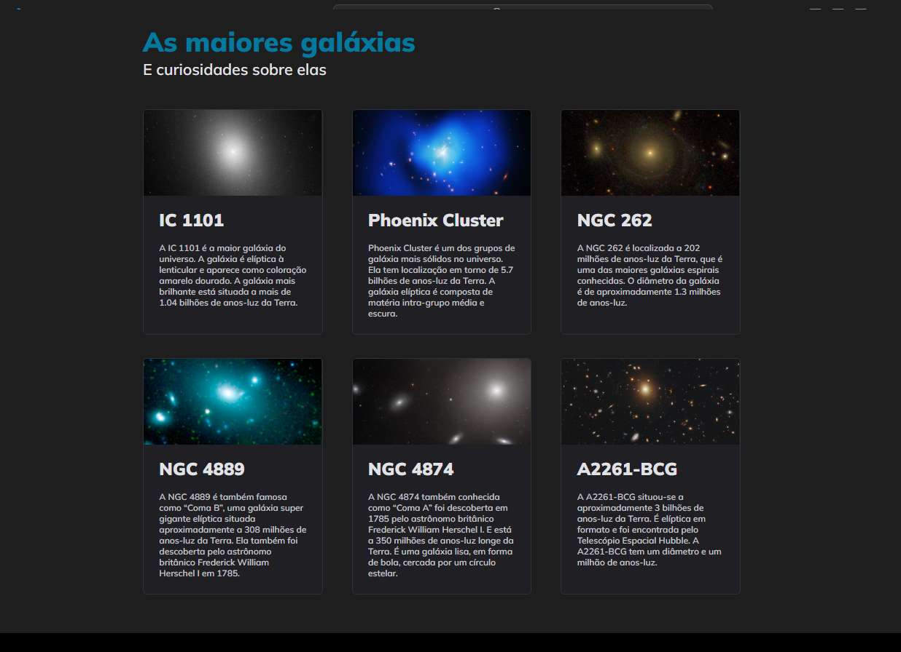

# Projeto Galaxies do curso Explorer da Rocketseat

    
    
    

Este projeto é uma página que destaca algumas das maiores galáxias conhecidas, apresentando informações e curiosidades sobre elas.

## :exclamation: Pré-requisitos

Navegador web moderno

## :hammer: Intalação

1. Clone o repositório: git clone https://github.com/Raissa-Cardoso/XR-Galaxies.git
2. Abra o arquivo `index.html` em seu navegador web.

## :computer: Uso

Após abrir o arquivo `index.html` em seu navegador, você verá uma página que destaca algumas das maiores galáxias conhecidas, cada uma com sua imagem e informações detalhadas.

## :star: Tecnologias utilizadas

- **`HTML`**
- **`CSS`**
